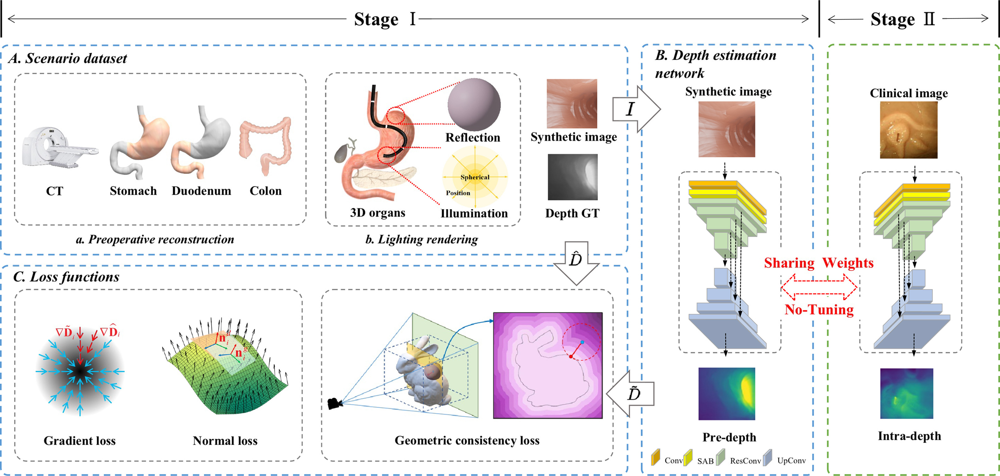
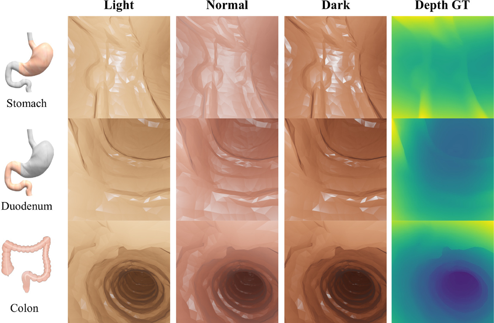

## A geometry-aware deep network for depth estimation in monocular endoscopy
[[ Paper ](https://doi.org/10.1016/j.engappai.2023.105989)] [[ Project ](https://github.com/YYM-SIA/LINGMI-MR)]  
  

  

## Installation
```
$ git clone https://github.com/YYM-SIA/LINGMI-MR  
$ cd LINGMI-MR
$ pip install -r requirements.txt  
```
  
## Datasets
You can download EndoSLAM dataset from [here](https://github.com/CapsuleEndoscope/EndoSLAM) and ColonoscopyDepth dataset from [here](http://cmic.cs.ucl.ac.uk/ColonoscopyDepth/).  
You can also download our scenario dataset from [here](https://mega.nz/file/vcQhzBrK#dVLeAA0g6PKsEhJfVEme54F8ap5wefQ6cET1dZoCgeE).  

  
## Training
Training with our scenario dataset
```
train_depth.py --config configs/blender_train.json
```

## Test
Run the inference using scenario model
```
eval_depth.py --config configs/blender_eval.json
```  

## Models
Model|Base Network|Abs.Rel.|Sqr.Rel|RMSE|RMSElog|a1|a2|a3|
--|:--|:--|:--|:--|:--|:--|:--|:--|
[Scenario](https://mega.nz/file/SZxQ3CKC#LXYnA-I4yRtS6ADS6Aqpad6uXcvbPn4Pzl6XlxEaJVs)|ResNet18|0.276|0.017|0.066|0.349|0.517|0.819|0.941

## Demo
<video id="video" controls="" preload="none">
      <source id="mp4" src="files/video.mp4" type="video/mp4">
</video>

## Citation
If you find our work useful please consider citing our paper:
```
@article{YANG2023105989,
title = {A geometry-aware deep network for depth estimation in monocular endoscopy},
author = {Yongming Yang and Shuwei Shao and Tao Yang and Peng Wang and Zhuo Yang and Chengdong Wu and Hao Liu},
journal = {Engineering Applications of Artificial Intelligence},
volume = {122},
pages = {105989},
year = {2023},
}
```

## Acknowledgements
Thanks to Shuwei Shao for his excellent work [AF-SfMLearner](https://github.com/ShuweiShao/AF-SfMLearner), and Jin Han Lee for his [BTS](https://github.com/cleinc/bts), Ozyoruk for his [EndoSLAM](https://github.com/CapsuleEndoscope/EndoSLAM), Recasens for his [Endo-Depth-and-Motion](https://davidrecasens.github.io/EndoDepthAndMotion), Godard for his [Monodepth2](https://github.com/nianticlabs/monodepth2).